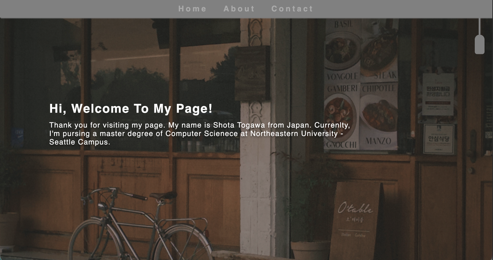
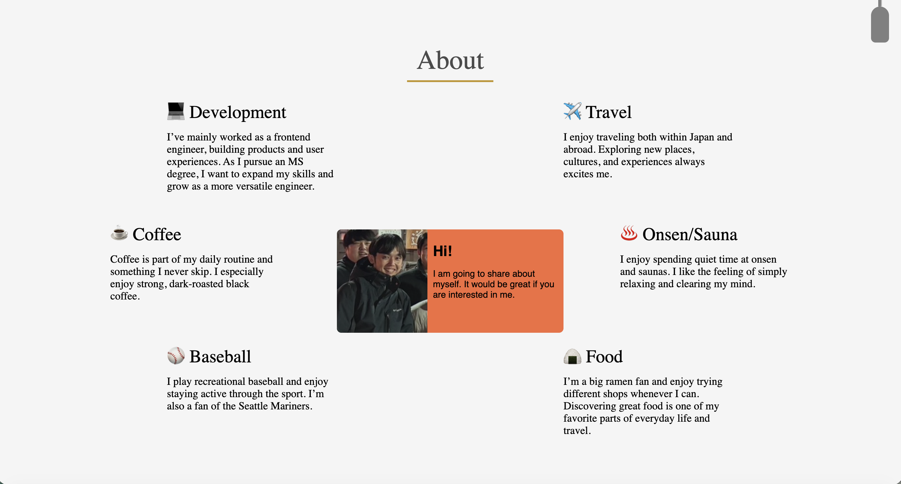
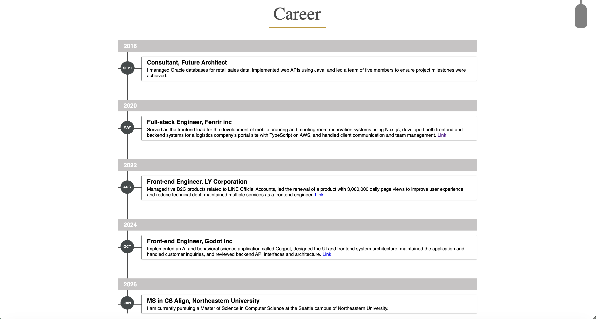
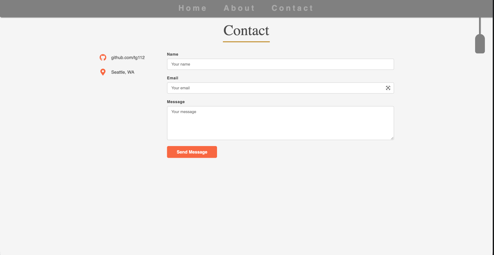

# Shota Togawa — Personal Homepage

## Author

**Shota Togawa**
MS in CS Align, Northeastern University — Seattle Campus
GitHub: [tg112](https://github.com/tg112)

## Class Link

[CS 5008 — Internet Technologies](https://github.com/tg112/homepage)

## Project Objective

A personal homepage that introduces who I am — my background, career history, interests, and contact information. The site consists of three pages (Home, About, Contact) and includes an animated hero slideshow, a career timeline, and a working contact form.

## Shortmovie


## Screenshot







## Instructions to Build

**Prerequisites:** Node.js 18+

```bash
# Install dependencies
npm install

# Lint JS files
npx eslint js/

# Format JS files
npx prettier --write js/

# Open locally (no build step required — static site)
open index.html
```

The project is a static site with no bundler. Open `index.html` directly in a browser or serve it with any static file server:

## GenAI Tools

| Tool | Version | Usage |
|------|---------|-------|
| Claude (Anthropic) | claude-sonnet-4-6 | Generated MIT LICENSE and the initial structure and content of `contact.html` (the AI-generated page). Also used to review the project against the course rubric. |
| Gemini | 3.5 Flash | Made 3 user personas and 3 user stories for my portfolio. | 

**Prompts used:**

- "Generate a contact page for a personal homepage with a contact form and info panel using flexbox layout"
- "Review this homepage against the CS5008 rubric and list what's missing"
- "Please make 3 user personas and 3 user stories for my portfolio.

All generated code was reviewed, understood, and manually adjusted before committing.
